# Bloodline RP — FiveM Technical Case Study

Bloodline RP is a custom FiveM roleplay server project built as a hands-on engineering and community project. This repository documents the technical scope of the server, the systems I developed or integrated, the design decisions behind them, and the evidence of the project running in-game.

> **Important:** this repository is a case study. It does not claim ownership of Grand Theft Auto V, FiveM, third-party frameworks, external assets, or dependencies. Where third-party resources were used, they were configured, integrated, extended, or adapted as part of the wider Bloodline RP server.

## Project Overview

The objective was to build a coherent multiplayer roleplay environment rather than a collection of isolated scripts. The server combined player progression, vehicles, economy, businesses, role-based systems, administration tools, custom interfaces, and competitive gameplay into one connected experience.

Key areas included:

- vehicle dealership and purchasing workflows
- persistent garage and vehicle-transfer systems
- fuel and refuelling mechanics
- fuel-company management and stock control
- EMS/job-specific systems
- configurable business/shop functionality
- deployable item interactions
- competitive TDM/FFA rooms and arenas
- custom spawn-location flow
- extensive map, service, and job configuration
- Bloodline-branded UI and in-game presentation

## My Contribution

I built Bloodline RP independently as a practical development project, learning from documentation, tutorials, FiveM resources, and experimentation while carrying out the server build, configuration, integration, testing, and customisation myself.

My contribution included:

- designing the overall server structure and player experience
- installing and configuring server resources
- integrating systems so that jobs, vehicles, economy, businesses, and interfaces worked together
- adapting and customising scripts and configuration
- testing workflows in-game and troubleshooting integration issues
- developing Bloodline-specific UI, branding, locations, and gameplay flows where applicable
- configuring server-side roles, jobs, locations, interactions, vehicles, shops, and economy behaviour
- managing hosting and the operational server environment
- building and managing the associated player community

I distinguish in this case study between custom work, integration/configuration work, and external dependencies rather than presenting third-party components as original code.

## Technical Case Study

### 1. Vehicle & Garage Ecosystem

The vehicle system was designed as an interconnected workflow rather than a single dealership interaction.

It included:

- dealership inventory and stock
- vehicle detail pages
- pricing and purchase flow
- test-drive functionality
- persistent owned-vehicle storage
- multiple garages
- vehicle transfer between garages
- job-specific garages
- integration with the wider economy

#### Visual evidence

| Dealership & stock | Vehicle purchase | Persistent garage |
|---|---|---|
| 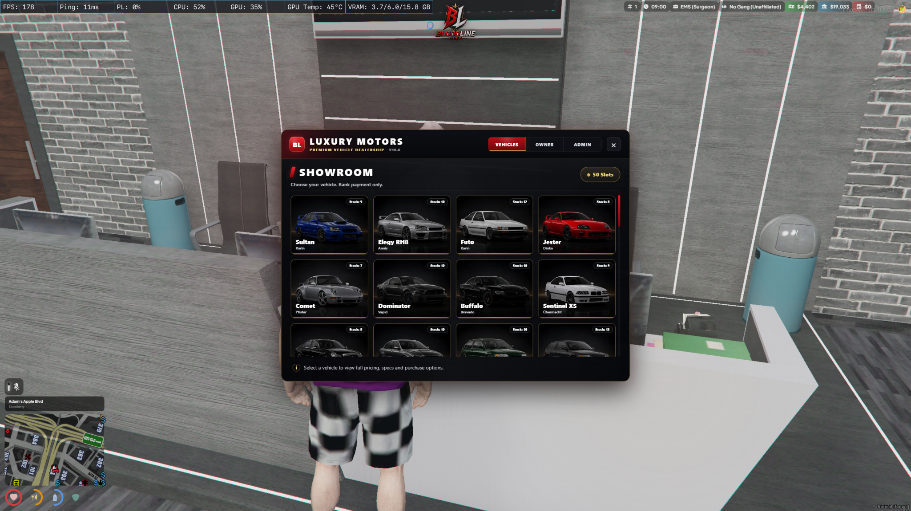 | 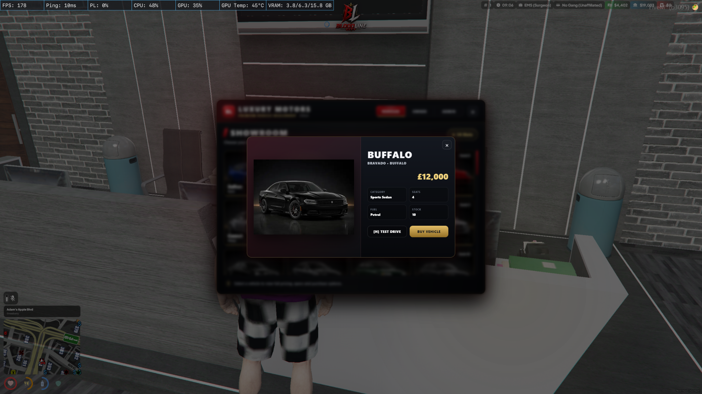 | 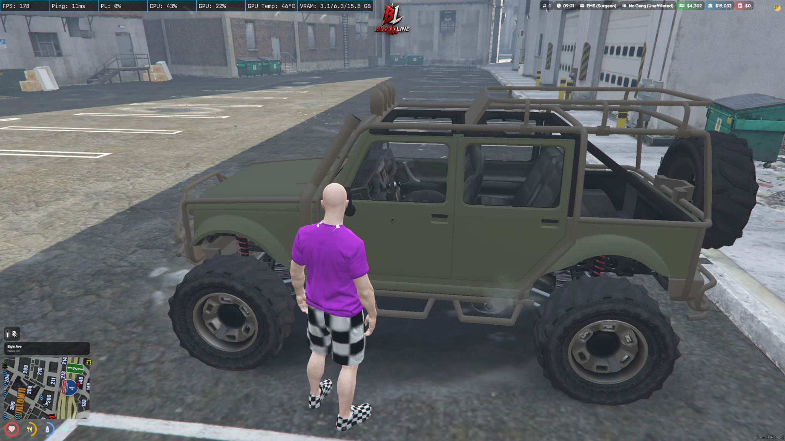 |

*The screenshots above show the dealership catalogue, vehicle purchase/detail flow, and owned-vehicle garage management running inside the Bloodline RP environment.*

### 2. Fuel & Economy Systems

Bloodline RP included a player-facing refuelling system connected to a larger business-management layer.

The player fuel flow included:

- vehicle identification
- current fuel percentage
- tank capacity
- calculated litres required
- multiple fuel grades
- configurable quantities
- dynamic total price
- cash and bank payment options

A separate Bloodline Fuel Company management interface included:

- company cash
- depot stock
- fuel-grade inventory
- active station monitoring
- low-stock warnings
- wholesale pricing
- station controls
- staff management
- history
- administrative controls

This demonstrates how a small gameplay interaction could be connected to a broader economic and operational system.

#### Visual evidence

| Player refuelling | Fuel company operations |
|---|---|
| 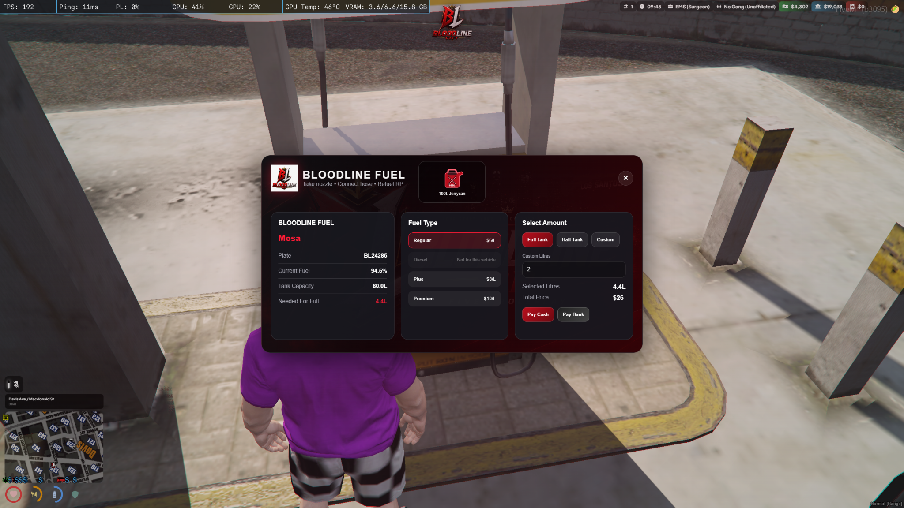 | 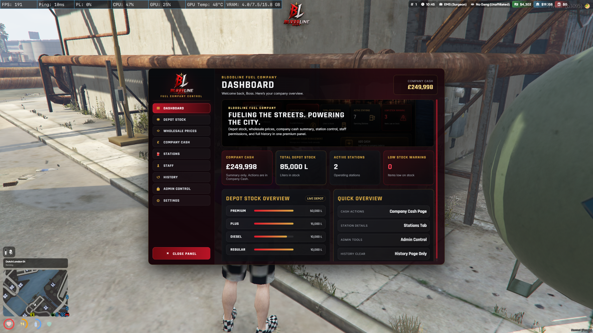 |

*The player-facing refuelling workflow sits alongside a broader fuel-company dashboard for inventory, station and business management.*

### 3. EMS & Role-Based Systems

The server included role-specific gameplay and interfaces for EMS and other jobs.

Examples included:

- EMS job vehicle access
- ambulance spawning
- EMS operational interfaces
- payment/economy logic
- role-based interactions
- job-specific locations and garages

#### Visual evidence

| EMS operations | Bloodline EMS | EMS garage |
|---|---|---|
| 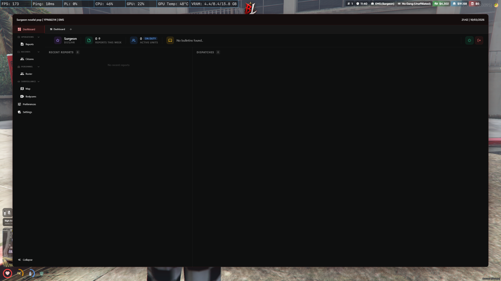 | 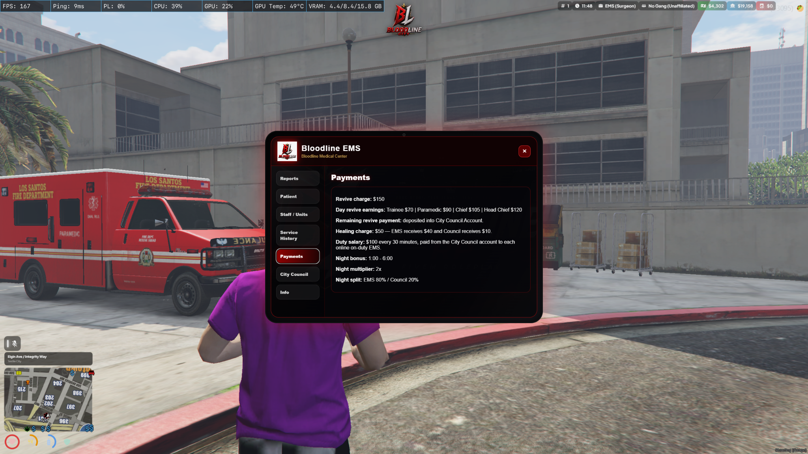 | 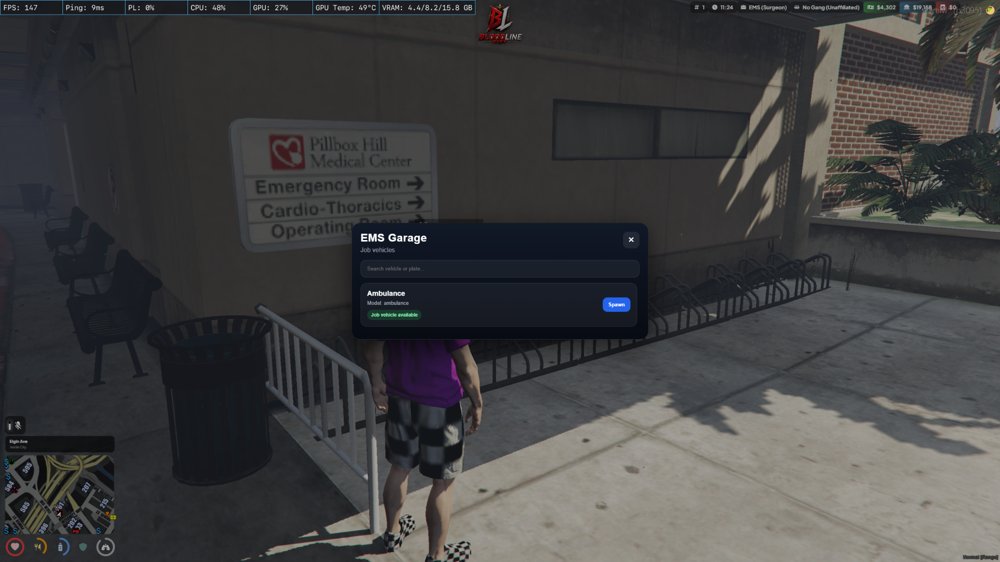 |

*These screens demonstrate role-specific interfaces and vehicle access integrated into the wider server.*

### 4. Business & Shop Systems

Business systems included configurable shop functionality and ownership/management interfaces.

Features demonstrated in the project included:

- product inventory
- stock counts
- configurable prices
- business revenue
- sales history
- owner controls
- bank withdrawal
- interactive purchase interfaces

#### Visual evidence

| Player shop | Owner management |
|---|---|
| 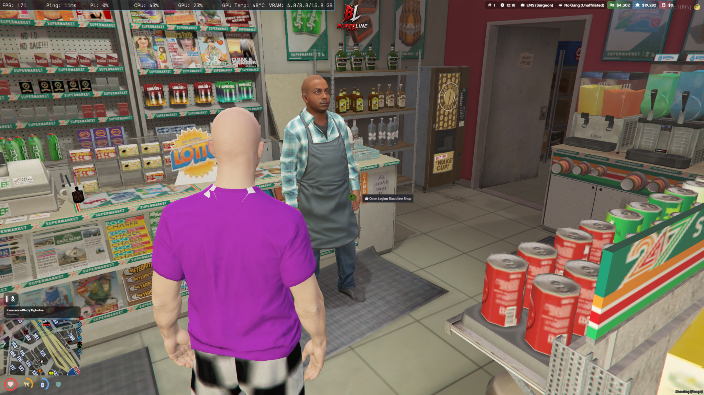 | 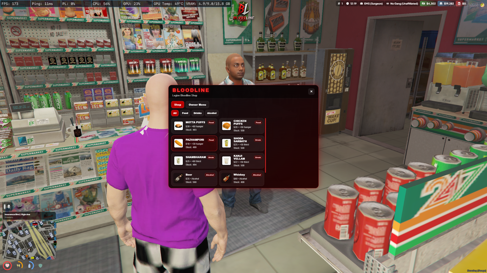 |

### 5. Deployable Item System

The server included an interactive tent system in which a player could purchase a tent pack and deploy it into the game world.

This connected:

- NPC interaction
- purchase UI
- inventory/item logic
- world-object placement
- player interaction

#### Visual evidence

| Purchase flow | Deployed world object |
|---|---|
| 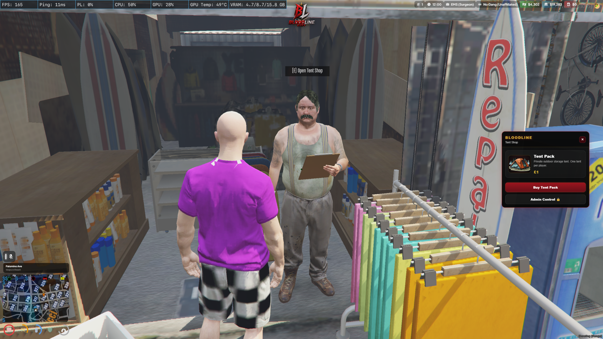 | 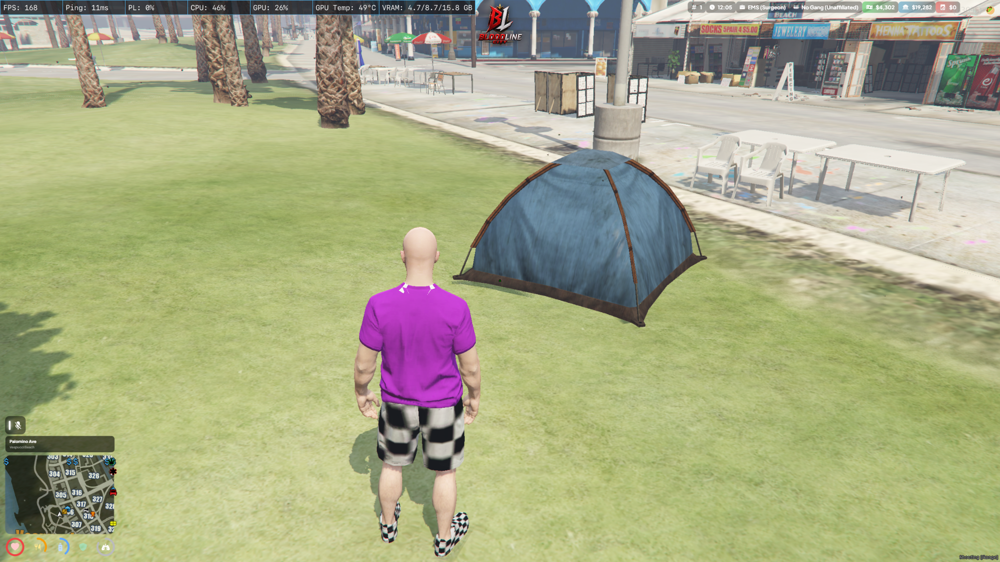 |

*Together these show the transition from an interactive purchase flow to an item deployed in the game world.*

### 6. Competitive TDM / FFA System

Bloodline RP also included a separate competitive combat module.

The TDM/FFA system included:

- public FFA arenas
- private team rooms
- multiple selectable maps
- room names
- optional passwords
- round-win configuration
- team-size limits
- room creation
- active-room joining

This was designed as a distinct gameplay mode accessible from within the wider Bloodline environment.

#### Visual evidence

| TDM menu | Private room configuration | Public FFA |
|---|---|---|
| 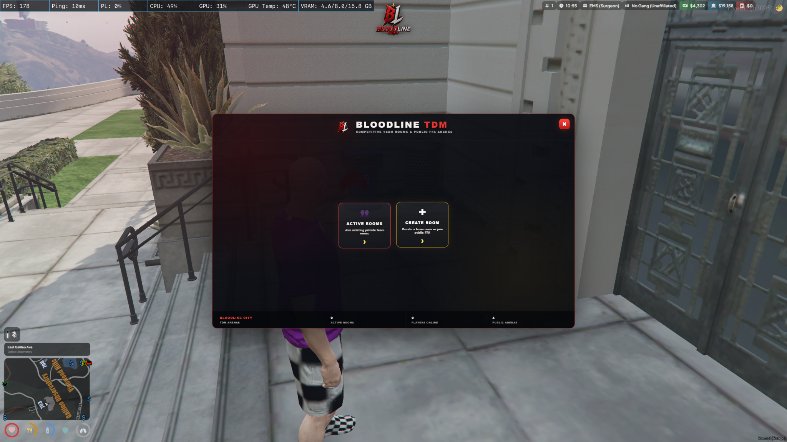 | 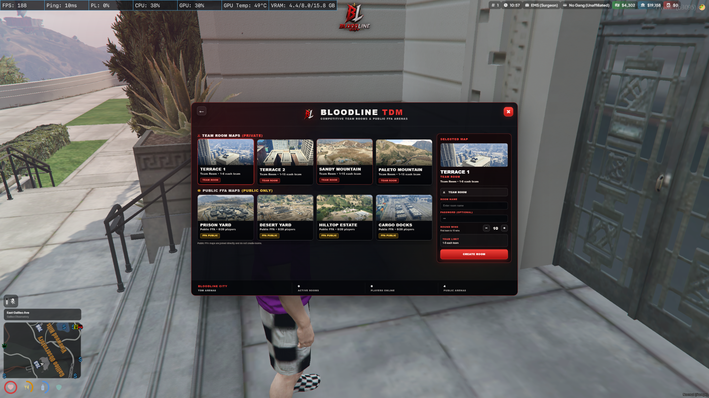 | 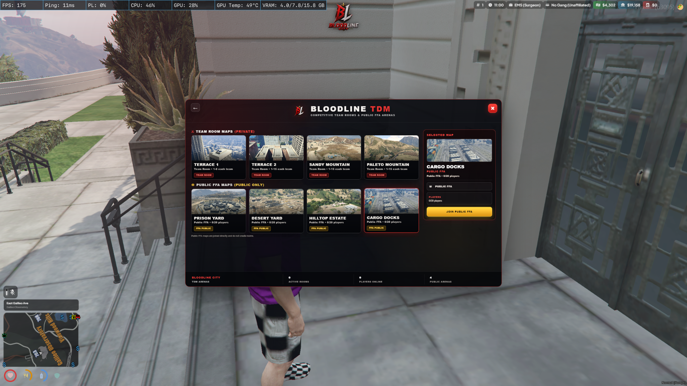 |

### 7. Spawn & World Configuration

The server included a custom spawn-location flow and a large configured world containing jobs, garages, shops, services, repair locations, police infrastructure, delivery activities, fishing, and Bloodline-branded locations.

Example spawn locations included:

- last location
- hospital
- airport
- city centre
- beach

The world configuration connected these systems into a coherent player experience.

#### Visual evidence

| Spawn selection | Bloodline locations | Jobs & services |
|---|---|---|
| 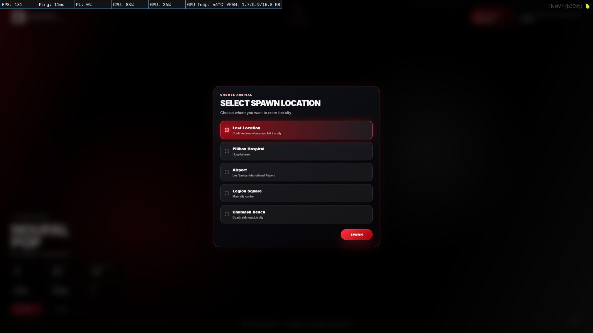 | 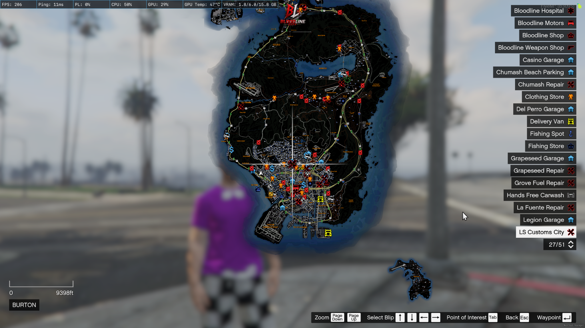 | 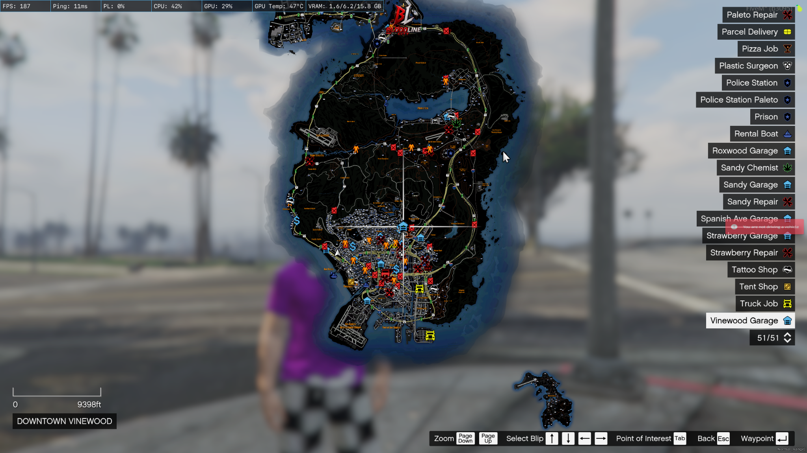 |

*These screens document player entry and the wider configured world of Bloodline-branded locations, jobs and services.*

## Engineering Approach

The project required more than installing scripts individually. The main challenge was integration: making multiple resources behave as one server.

Typical work included:

1. configuring resources and dependencies
2. resolving compatibility and load-order issues
3. connecting jobs and permissions
4. aligning economy values and payment flows
5. configuring map locations and interaction points
6. adapting interfaces and branding
7. testing end-to-end player workflows
8. debugging issues across client and server resources
9. validating changes inside the live FiveM environment

## Evidence

This repository includes curated screenshots showing the systems operating in-game. The images are grouped alongside the relevant technical sections above so each visual is tied to the functionality it demonstrates.

Current technical evidence categories:

- vehicle and dealership systems
- garage and vehicle transfer
- refuelling
- Bloodline Fuel Company dashboard
- EMS systems
- business/shop management
- deployable tent system
- TDM/FFA system
- spawn flow
- world/map configuration
- Bloodline branding

Community and adoption evidence will be documented separately from technical evidence so that implementation and usage are not conflated.

## Community & Impact

Bloodline RP was deployed and operated as a live FiveM roleplay community supported by a structured Discord-based onboarding and whitelist workflow. This section documents community scale and the operational process separately from the technical implementation evidence above.

### Community Scale

The Bloodline City Discord reached **219 members** at the time captured in the community evidence.

*Discord member-management view showing an aggregate total of 219 members. Personal information has been redacted in the published evidence.*

### Whitelist Application

Prospective players could begin a structured passport/whitelist application before receiving access to the roleplay environment.

*Bloodline City whitelist application entry point.*

### Verification & Interview Workflow

Applications progressed through a verification stage, with successful verification leading to an interview before a final decision.

*Operational application-processing workflow. User-identifying information has been redacted.*

### Accepted Applications

Successful applicants could be approved and granted the appropriate community/server access after completing the process.

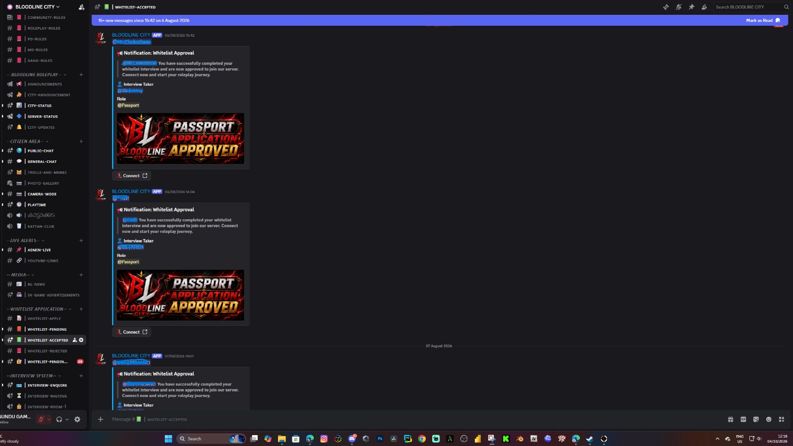

*Example of the accepted-application workflow. User-identifying information has been redacted.*

### Rejected Applications

The process also supported rejected outcomes rather than automatically admitting every applicant.

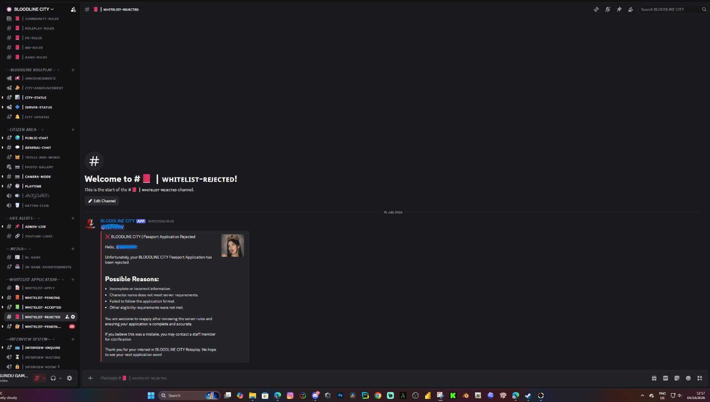

*Example of the rejected-application workflow. User-identifying information has been redacted.*

### What the Community Evidence Demonstrates

Together, these records show that Bloodline RP extended beyond a private development environment into an operated community project with:

- a **219-member Discord community** at the captured point in time;
- a structured player application and verification process;
- interview-based whitelist progression;
- accepted and rejected application outcomes;
- role and access management; and
- ongoing community administration around the technical server.

> **Privacy note:** Community screenshots are included as project evidence. Personal/user-identifying information has been redacted where appropriate.

## Repository Structure

The repository currently keeps the curated evidence images at the repository root so the case-study README can reference them directly. Supporting documentation and community-impact evidence can be added separately as the case study develops.

## Technology Context

Bloodline RP was developed within the FiveM ecosystem for Grand Theft Auto V. Depending on the resource, the project involved typical FiveM technologies and configuration patterns such as Lua, JavaScript/HTML/CSS-based NUI interfaces, JSON/configuration files, database-backed resources, and client/server event-driven logic.

Specific technologies and dependencies will be documented only where they can be accurately verified from the project files.

## Authorship & Third-Party Resources

This repository is intentionally transparent about authorship.

Bloodline RP was independently assembled, configured, integrated, customised, tested, and operated by me. However, FiveM servers commonly depend on external frameworks, open-source resources, maps, vehicles, libraries, and game assets.

Accordingly:

- I do not claim ownership of GTA V or FiveM.
- I do not claim original authorship of external resources simply because they were used in the server.
- Custom development, configuration, integration, modifications, and Bloodline-specific work will be identified separately.
- Original third-party licence and attribution requirements should remain respected.

## Status

This repository is a retrospective technical case study documenting the server's technical systems and community deployment. Additional architecture and contribution documentation may be added as the project record develops.

---

**Project:** Bloodline RP  
**Platform:** FiveM / GTA V  
**Role:** Independent builder, developer, integrator, server operator and community administrator
